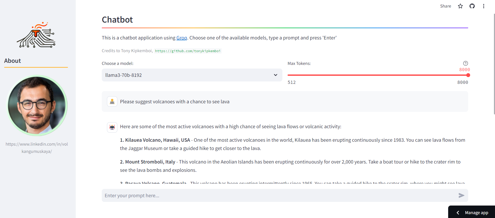

# Groq Chat Streamlit App

This [Streamlit](https://streamlit.io/) app is a ChatBot using [Groq API](https://groq.com/), where users can select different models to generate response. The listed models are those supported by Groq and updated everyday. Credits to *Tony Kipkemboi* as the app is created by forking his [repo](https://github.com/tonykipkemboi/groq_streamlit_demo). 

Try it here: https://groq-api-volkan-ai.streamlit.app/

  
   
    <em>App screenshot</em>

## Features

- **Model Selection**: As of 27/08/2024, users can select among the following models:
    - gemma2-9b-it
    - gemma-7b-it,
    - llama-3.1-70b-versatile
    - llama-3.1-8b-instant
    - llama3-70b-8192
    - llama3-8b-8192
    - llama3-groq-70b-8192-tool-use-preview
    - llama3-groq-8b-8192-tool-use-preview
    - llama-guard-3-8b
    - mixtral-8x7b-32768  
- **Chat History**: The app maintains a session-based chat history, allowing for a continuous conversation flow during the app session.
- **Dynamic Response Generation**: Utilizes a generator function to stream responses from the Groq API, providing a seamless chat experience.
- **Error Handling**: Implements try-except blocks to handle potential errors gracefully during API calls.

## Usage

Upon launching the app, you are greeted with a title and a model selection dropdown.

After choosing a preferred model, you can interact with the chat interface by entering prompts. The variable `max token` is the maximum number of words chatbot will generate, and can be modified by the user. 

The app displays the users questions and the AIs responses, facilitating a back-and-forth conversation.

## Customization

The app can be easily customized to include additional language models (as Groq adds more), alter the user interface, or extend the functionality to incorporate other interactions with the Groq API.
